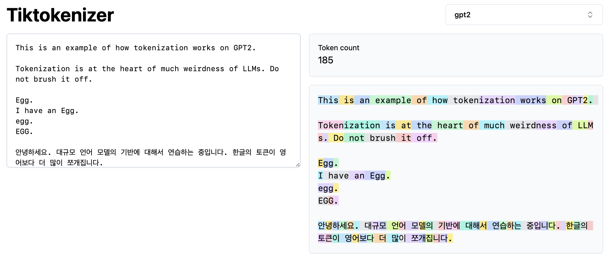
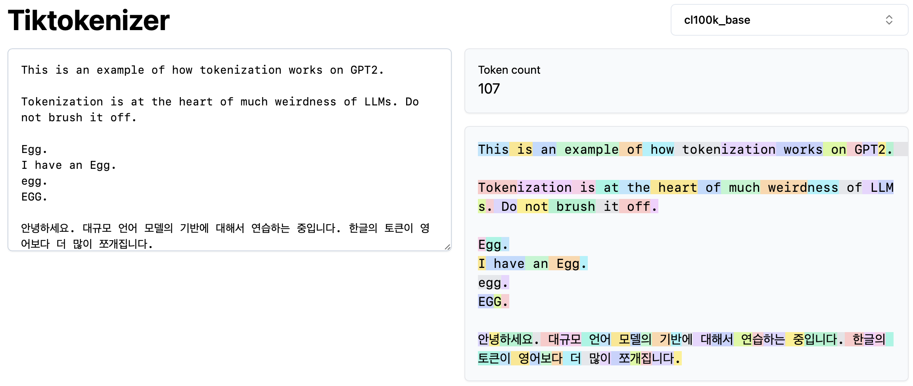

# Tokenization
This repo contains codes I've studied by following [Andrej Karpathy's GPT Tokenizer video](https://www.youtube.com/watch?v=zduSFxRajkE&t=1377s).

## Tiktokenizer experiment
* [Tiktokenizer](https://tiktokenizer.vercel.app) is an interactive website where you can type text and see how models like GPT-2 and GPT-3 tokenize it.
* Each color represents different tokens.

### GPT2 Tokenizer
 
 
* In this image, you can see how GPT2 Tokenizer works.
* Two main things:
  * `Egg.`, `egg.`, `EGG.` is tokenized differently - all recognized as different word and needs to be trained in order to find meanings.
  * Non-english languages are tokenized a bit differently. For example, with Korean, more tokens are created compared to English. This is one of the reasons why English performs better on LLMs like GPT (other reasons are related to datasets).
* 185 Tokens

### GPT4 Tokenizer (cl100k_base)
 
 
* In this image, you can see how GPT4 Tokenizer (cl100k_base) works.
* Compared to GPT2 Tokenizer, GPT4 Tokenizer uses less tokens (185 vs 107)
* In languages like Korean, it still creates more tokens than English but less than what GPT2 Tokenizer did.
